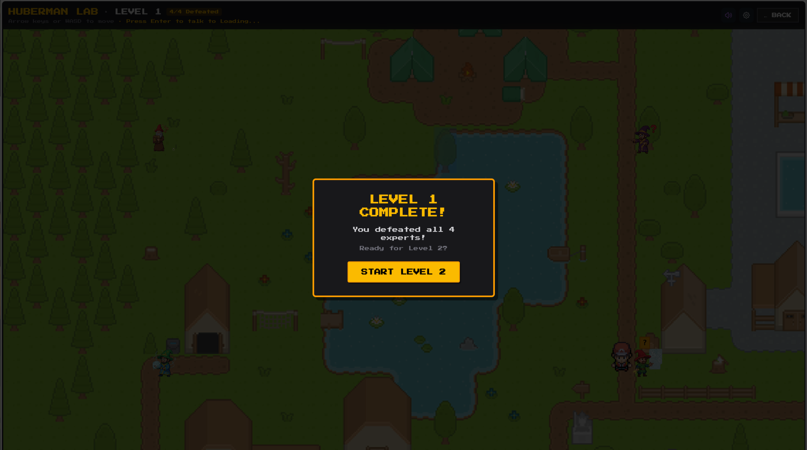
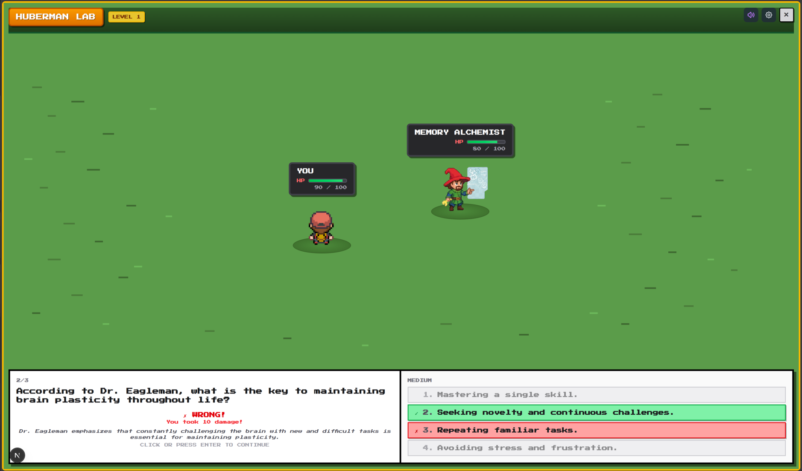
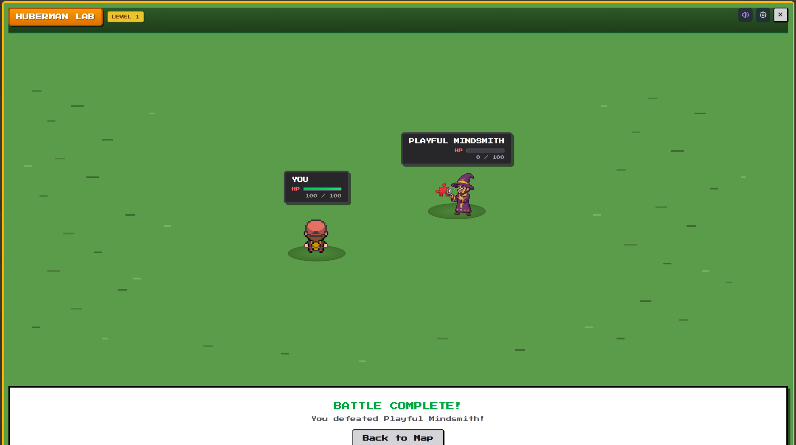

# Anything → RPG

> **Turn passive knowledge into an interactive RPG adventure.**

A Playable Memory Palace that transforms any PDF, book, or knowledge base into a retro-styled RPG quiz game — helping you actually remember what you learn.

<p align="center">
  
</p>

<p align="center">
  
  
</p>

<p align="center">
  
</p>

---

## 🎯 The Problem

We fail to transfer information into long-term memory. Studies show **passive watching and reading leads to 90% memory loss within 7 days**. Despite consuming hours of educational content, we retain almost nothing.

Traditional learning is broken because:
- **Passive consumption** doesn't create lasting neural pathways
- **No active recall** means no memory consolidation
- **No engagement** leads to distraction and boredom

## 💡 The Solution

**Anything → RPG** is a playable memory palace that transforms passive knowledge into interactive RPG quests.

Upload any PDF — a book, course notes, research paper — and our AI automatically:
1. **Splits it into chapters** using intelligent parsing
2. **Extracts key insights** from each section
3. **Generates quiz questions** at varying difficulty levels
4. **Creates an RPG world** where you battle NPCs by answering questions

**Why it works:**
- 🧠 **Active Recall**: Answering questions boosts retention by 50% vs. passive reading
- 🎮 **Gamification**: Game mechanics (XP, levels, progress) trigger dopamine and motivation
- 🔁 **Spaced Repetition**: Multiple levels reinforce learning over time
- ⚔️ **Learn by Doing**: Interactive quizzes create stronger memory traces

---

## ✨ Features

- **📤 PDF Upload**: Transform any document into a playable game
- **🤖 AI-Powered Questions**: GPT-4 generates contextual quiz questions from your content
- **🎮 Retro RPG Experience**: Beautiful pixel-art world built with Phaser 3
- **👹 NPC Battles**: Defeat knowledge guardians by proving your understanding
- **📊 Progress Tracking**: Level-based progression with persistent state
- **🏆 Leaderboards**: Compete with others on the same learning content
- **🎵 AI-Generated Music**: Each world has unique ElevenLabs-generated soundtrack — new PDFs get new music!
- **🌍 Community Worlds**: Share your creations or play others' games

### Built-in Games
- **Huberman Lab** — Neuroscience & health protocols
- **Learning Cursor** — IDE and AI coding documentation
- **The Art of War** — Sun Tzu's timeless strategies

---

## 🧰 Powered By

This project leverages cutting-edge AI tools and hackathon sponsor technologies:

| Tool | How We Used It |
|------|----------------|
| **🎵 ElevenLabs** | AI-generated background music — each game world has its own unique soundtrack, and every new PDF upload generates fresh music |
| **🧠 OpenAI GPT-4** | Powers the entire question generation pipeline — extracting insights from content and creating contextual quiz questions |
| **🎨 Google Gemini** | Asset generation for game visuals and sprites |
| **🎯 v0** | Rapid UI prototyping for the pixel-art interface |
| **🤝 Miro** | Team collaboration, user flow mapping, and ideation |
| **⚡ Cursor** | Vibe coding with AI — built the entire codebase with agentic AI assistance |

---

## 🛠️ Tech Stack

### Frontend
- **Next.js 16** + **React 19** — Modern web framework
- **Tailwind CSS 4** — Utility-first styling with pixel-art theme
- **Phaser 3** — 2D game engine for the RPG experience
- **TypeScript** — Type-safe codebase

### Backend
- **FastAPI (Python)** — PDF processing and transcript extraction
- **Supabase** — PostgreSQL database, auth, and file storage

### AI Services
- **OpenAI GPT-4o-mini** — Question generation and insight extraction
- **Google Gemini** — Asset and sprite generation
- **ElevenLabs** — Dynamic music generation per game world

### Processing
- **unpdf** — PDF parsing and text extraction
- **youtube-transcript-api** — YouTube video transcript extraction

---

## 🚀 Getting Started

### Prerequisites
- Node.js 18+
- Python 3.9+
- OpenAI API key

### Quick Start

1. **Clone the repository**
   ```bash
   git clone https://github.com/yourusername/youtube2rpg.git
   cd youtube2rpg
   ```

2. **Set up the backend**
   ```bash
   python -m venv venv
   source venv/bin/activate  # Windows: venv\Scripts\activate
   pip install -r requirements.txt
   ```

3. **Set up the frontend**
   ```bash
   cd frontend
   npm install
   ```

4. **Configure environment variables**
   
   Create `.env` in the root:
   ```env
   OPENAI_API_KEY=your_openai_key
   ```

   Create `frontend/.env`:
   ```env
   NEXT_PUBLIC_SUPABASE_URL=your_supabase_url
   NEXT_PUBLIC_SUPABASE_ANON_KEY=your_supabase_key
   OPENAI_API_KEY=your_openai_key
   ```

5. **Run the development servers**
   
   Backend:
   ```bash
   uvicorn main:app --reload
   ```

   Frontend:
   ```bash
   cd frontend
   npm run dev
   ```

6. **Open** [http://localhost:3000](http://localhost:3000)

---

## 🎮 How to Play

1. **Choose a Game** — Select from featured games or create your own
2. **Navigate the World** — Use arrow keys or WASD to move your character
3. **Approach NPCs** — Walk up to the knowledge guardians
4. **Battle!** — Press Enter to engage and answer quiz questions
5. **Level Up** — Defeat all 4 NPCs per level to advance
6. **Master the Content** — Complete all levels to conquer the game

---

## 📁 Project Structure

```
youtube2rpg/
├── frontend/                 # Next.js application
│   ├── app/                  # App router pages
│   │   ├── api/              # API routes
│   │   ├── create/           # PDF upload page
│   │   └── game/[id]/        # Game screen
│   ├── components/           # Shared UI components
│   ├── contexts/             # React contexts
│   └── public/               # Static assets (sprites, maps, music)
├── game/                     # Built-in game question data
├── generated_questions/      # AI-generated question sets
├── supabase/                 # Database migrations
├── main.py                   # FastAPI backend
├── generate_questions.py     # Question generation pipeline
└── prompts.py                # AI prompt templates
```

---

## 🧪 How Question Generation Works

1. **PDF Upload** → Content extracted via `unpdf`
2. **Chapter Detection** → AI identifies logical sections
3. **Insight Extraction** → Key facts and concepts identified
4. **Question Generation** → 3 questions per chapter at varying difficulty
5. **Game Creation** → Questions mapped to NPCs across levels

Each chapter becomes an NPC battle, with 4 NPCs per level creating a structured learning journey.

---

## 🏗️ Built at AI Beavers Hackathon

**Hamburg, Germany | January 31 - February 1, 2026**

This project was built in 48 hours as part of the AI Beavers Hackathon. The challenge: create something that could become a real product using AI tools.

### What We Built in 48 Hours
- Full PDF-to-RPG pipeline with **OpenAI GPT-4** question generation
- Real-time game engine with **Phaser 3**
- Dynamic music generation with **ElevenLabs** — unique soundtrack per game
- AI-generated game assets with **Google Gemini**
- Leaderboard and progress tracking with **Supabase**
- 3 fully playable demo games
- Beautiful pixel-art UI prototyped with **v0**
- Entire codebase built with **Cursor** AI-assisted development

---

## 👥 Team

Built with ❤️ and lots of ☕ by our hackathon team.

---

## 📄 License

MIT License — feel free to fork, modify, and build upon this project.

---

## 🔗 Links

- **Live Demo**: [Coming Soon]
- **Video Demo**: [Coming Soon]
- **Pitch Deck**: [Coming Soon]

---

<p align="center">
  <strong>Stop forgetting. Start playing. 🎮📚</strong>
</p>
